# Bluey's Quest For The Golden Pen -- cheats for Breeze

These cheats are made for [Breeze](https://github.com/tomvita/Breeze-Beta). Some are ordinary cheats you switch on. Others are starting points: open them in Breeze to find the game's own records and change them yourself. This guide shows both ways, starting with the lollies.

| | |
|---|---|
| Game | Bluey's Quest For The Golden Pen 1.0.2 |
| Title ID | `0100EF802631A000` |
| Build ID | `B34A5D9F6322D859` |
| Cheat file | [`B34A5D9F6322D859.txt`](B34A5D9F6322D859.txt) |
| Breeze | beta123.05 or later (the dictionary views and Extract below need it) |

To get the cheats, download [`B34A5D9F6322D859.txt`](B34A5D9F6322D859.txt) and copy it to `sdmc:/switch/breeze/cheats/0100EF802631A000/` on the SD card, then open the cheat menu in Breeze with the game running.

## The cheats

| Cheat | What it does | How to use it |
|---|---|---|
| Speed x2 | Bluey runs twice as fast | Hold **ZL** |
| Moon jump ZL+B | Bluey floats up | Hold **ZL+B** |
| Lollies 8 (Level00) | Sets the lollies of the first level to 8 | Turn on once, then off |
| Collectibles Dictionary | A way into the game's list of collectibles (see below) | **Do not turn on.** Open it with Edit Cheat |
| QuestRequirementSave requirementCount | Sets the beads counter of the beads quest | Turn on once, then off |

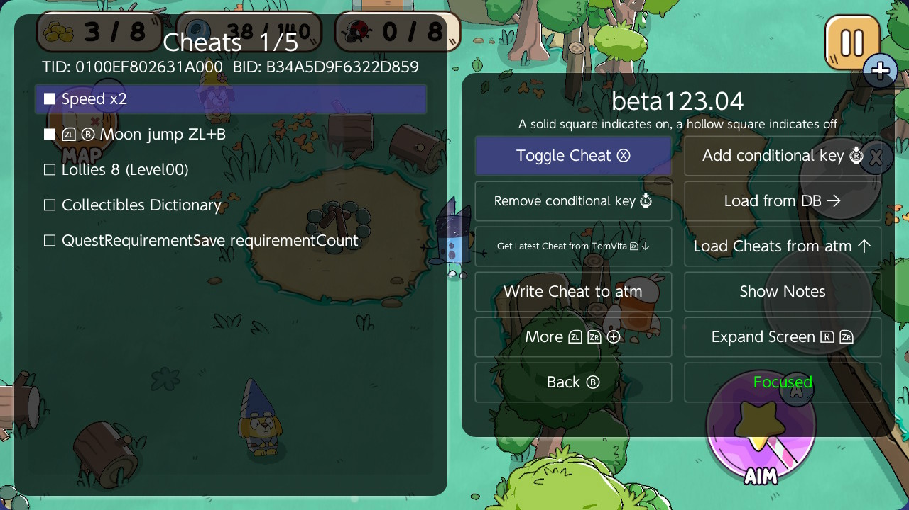

The three numbers at the top of the game screen are the lollies (yellow, 3 / 8), the beads (blue, 38 / 140) and the ladybugs (0 / 8). They are the numbers this guide goes after.

**Seeing every button.** Breeze starts with a short *Focused* set of buttons. Every action in this guide also has a key that works without its button showing. To see all the buttons, press **L+ZR** on any screen and choose **Switch view**. The screenshots below use the full view.

---

## 1. Lollies: from a cheat to the game's own record

The lolly cheat is a pointer cheat: it follows a chain of pointers from the game code to the lolly counter and writes 8 there. Breeze can follow the same chain for you and show you what is at the end of it.

**Step 1.** In the cheat list, put the cursor on **Lollies 8 (Level00)** and press **L** (*Edit Cheat*).

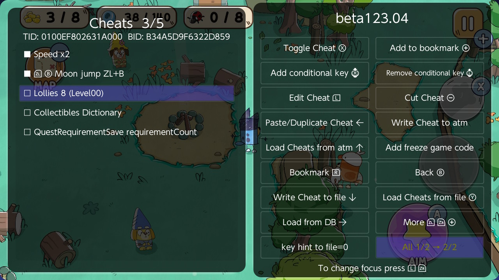

**Step 2.** Move the cursor to the first code line, `580F0000 08FFE988`, and press **ZL+Right** (*Jump to target*). For a pointer cheat, Jump to target starts from the line the cursor is on, so it must be the first line of the chain.

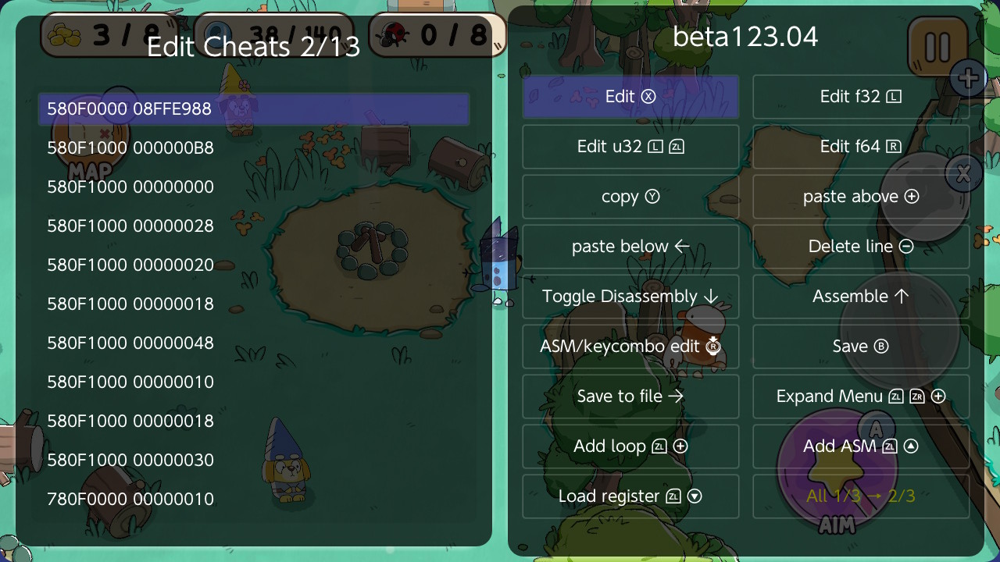

**Step 3.** The Memory Explorer opens on the value the cheat writes. The line at the top is the whole chain: `main+8FFE988+B8+0+28+20+18+48+10+18+30+10(8)`. The value there is 8.

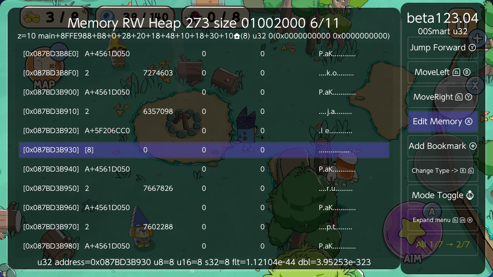

**Step 4.** Press **Y+ZL+ZR** (*Class field*). Breeze works out which game object that address belongs to and shows it with its field names:


- `m_levelBalance` is the lolly count, 8.
- The line at the bottom is the same chain in words:
  `CollectibleManager.Instance > saveData > collectibles["ProgressionCollectible00"] > levelBalance["Level00"]`

So the game keeps its collectibles in a dictionary (a list looked up by name). Each collectible has its own dictionary of levels, and each level has a count. This cheat changes one collectible in one level, **Level00**. In another level the count on your screen comes from another record, and the next sections show how to find it.

To change the value here, press **X** (*Edit value*). Press **B** to go back.

## 2. The whole collectibles dictionary

**Collectibles Dictionary** is not meant to be switched on. It is a bookmark into the game: its chain ends on the dictionary that holds every collectible. (It writes that dictionary's entry count, so enabling it could only cause trouble.)

**Step 1.** Edit Cheat (**L**) on **Collectibles Dictionary**, cursor on the first line, **ZL+Right** (*Jump to target*).

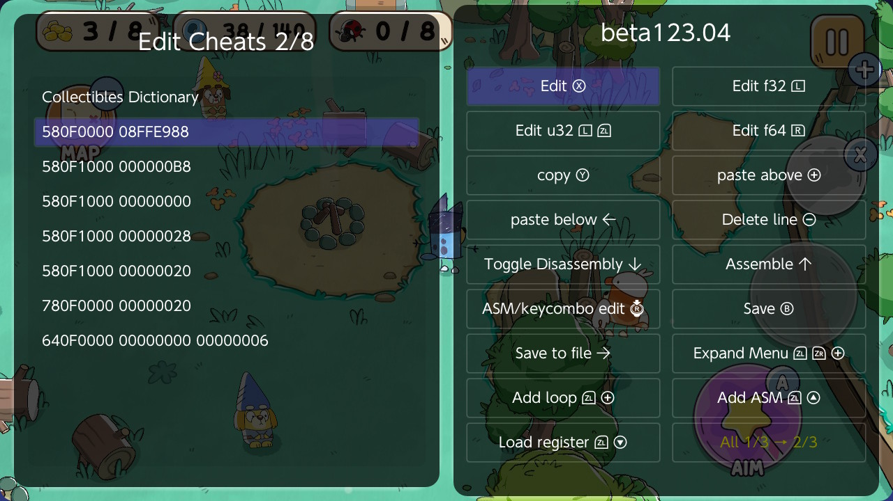

**Step 2.** In the Memory Explorer, **Y+ZL+ZR** (*Class field*). Breeze recognises a dictionary and lists it by entry:

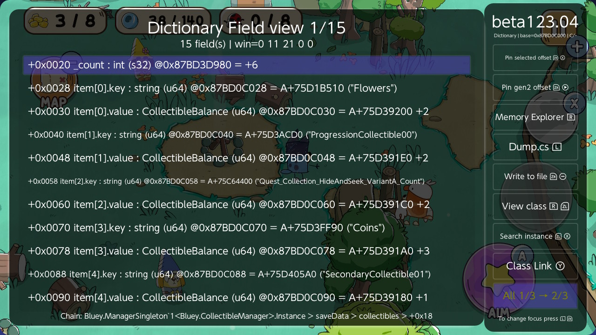

- `_count` is the number of entries, 6.
- Each entry is two rows: `item[n].key` is the name, and `item[n].value` is the record.
- The keys in this save: `Flowers`, `ProgressionCollectible00`, `Quest_Collection_HideAndSeek_VariantA_Count`, `Coins`, `SecondaryCollectible01` and `ProgressionCollectible01`.

A value row shows only an address (`A+75D391E0`), which says nothing about what is inside. The next two sections show two ways to see inside: go in with *View class*, or pull the numbers up onto these rows with *Extract*.

## 3. Going in: View class

Put the cursor on a value row and press **R+ZL** (*View class*) to open the object it points to. **B** goes back one step. Here the cursor is on `item[5].value`, the record for `ProgressionCollectible01`.

**One step in:** the collectible holds one field, `m_levelBalance`, which is its dictionary of levels. The chain line at the bottom now ends in `collectibles["ProgressionCollectible01"]`.

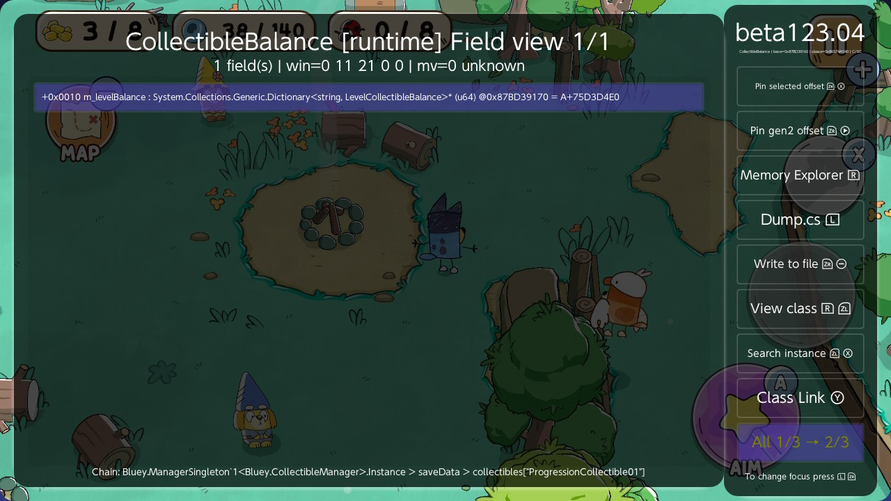

**Two steps in**, with the cursor on `m_levelBalance`: this collectible's levels. Only `Level01`.

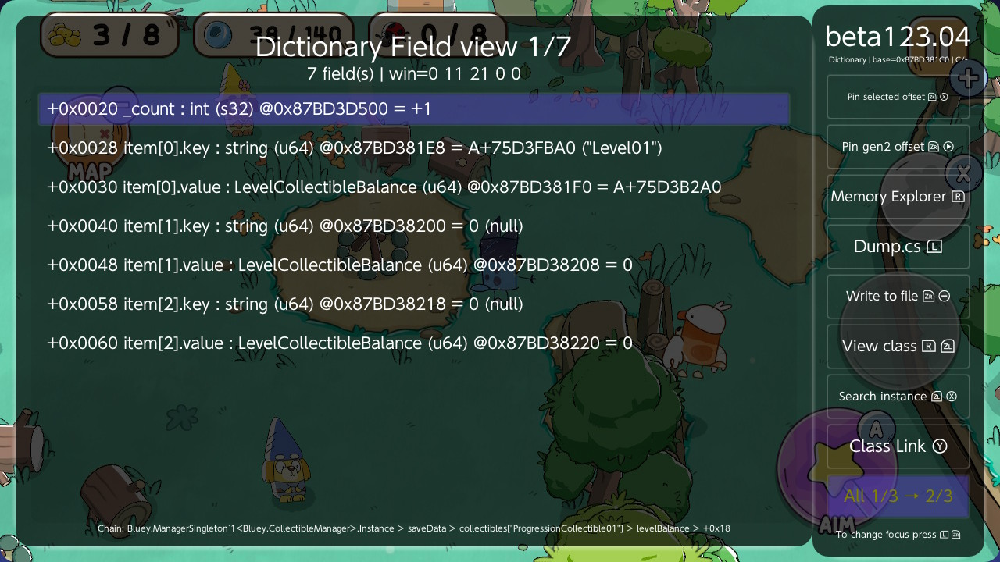

**Three steps in**, with the cursor on `item[0].value`: the Level01 record. The count is **3**, the same 3 as the lollies on the game screen.

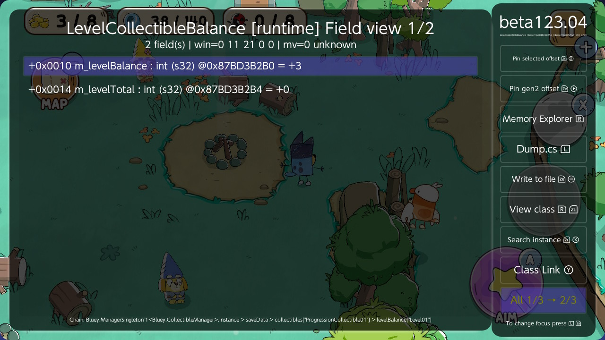

Press **X** (*Edit value*) to change the count, type the new number and confirm.

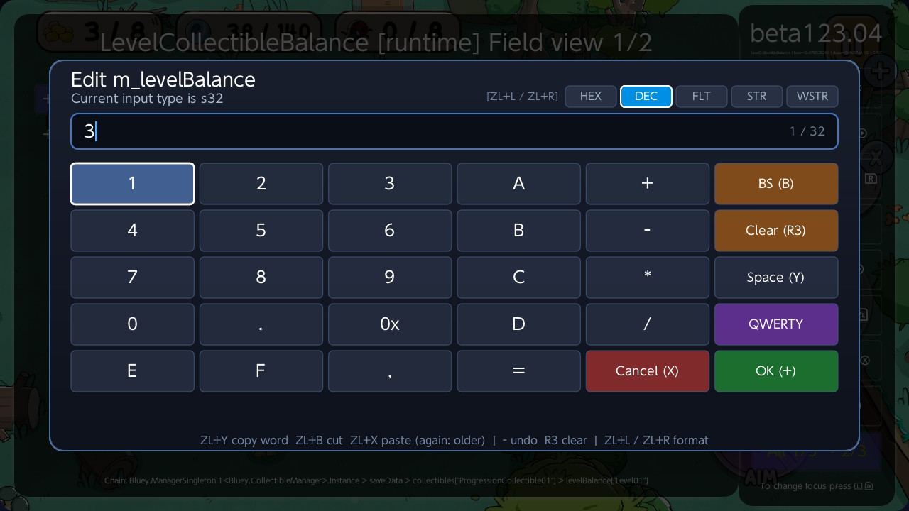

The game screen keeps showing the old number until you pick up the next item. Then it reads the record again.

## 4. Seeing the numbers on the list: Extract

Going in one record at a time is slow when you want to compare them all. **Extract** (**ZL+Minus**) lets you choose fields once, and Breeze then shows their values on every row of that type.

**Step 1.** In the dictionary view (section 2), put the cursor on a value row and press **ZL+Minus**. Breeze opens the record in *Extract pick* mode. The bottom line says `Extract: pick fields to show on CollectibleBalance rows`.

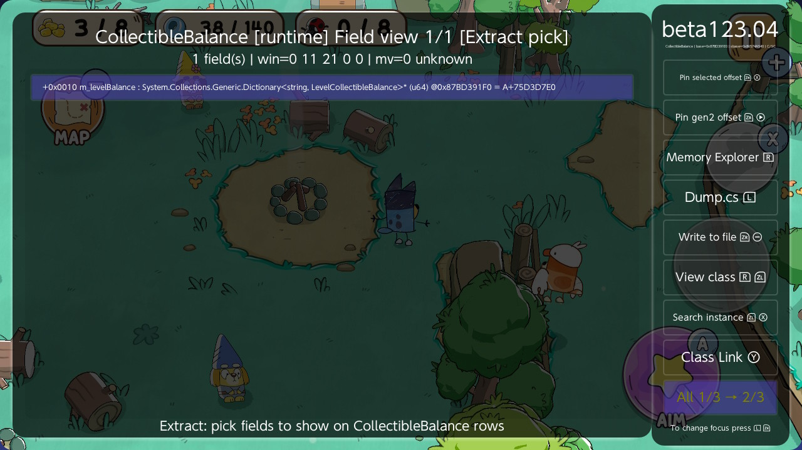

**Step 2.** The only field here is `m_levelBalance`, a dictionary, not a number. Press **ZL+Minus** on it again to go one level deeper. A row marked `*` is already shown on the list: `_count` (how many levels) was picked earlier.

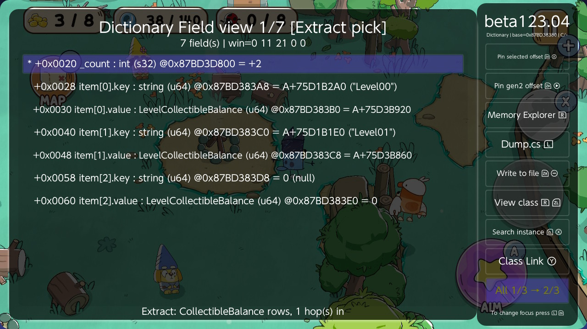

**Step 3.** Put the cursor on a level's value row (`item[0].value` is the first level) and press **ZL+Minus** again. On `m_levelBalance`, which *is* a number, **ZL+Minus** picks it. The row gets a `*`.

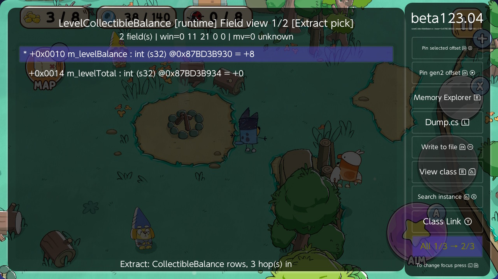

Press **B** to go back up, and repeat for the second level if you want it too. Pressing **ZL+Minus** on a row that has a `*` drops that pick.

**Step 4.** Back in the dictionary view, every collectible now shows its numbers after the address: the number of levels, then the first level's count, then the second's.

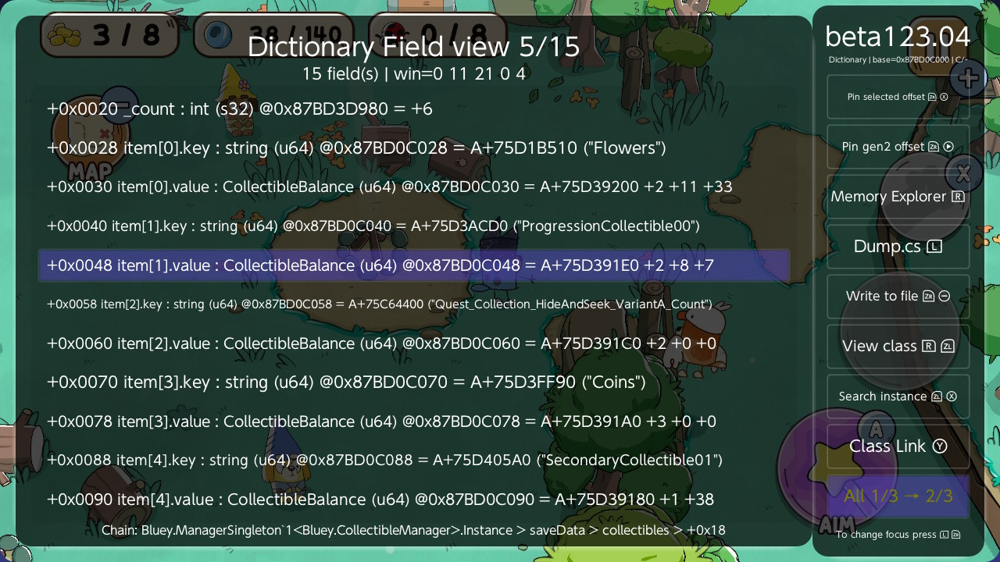

For this save:

| Key | Levels | First level | Second level | On the game screen |
|---|---|---|---|---|
| Flowers | 2 | 11 | 33 | |
| ProgressionCollectible00 | 2 | 8 | 7 | |
| Quest_..._HideAndSeek_..._Count | 2 | 0 | 0 | |
| Coins | 3 | 0 | 0 | |
| SecondaryCollectible01 | 1 | 38 | | blue, 38 / 140 |
| ProgressionCollectible01 | 1 | 3 | | yellow, 3 / 8 |

This is how to find the record behind a number on screen: pick the counts, then look for the row that shows the same number. Here the player is in Level01. The yellow 3 is `ProgressionCollectible01`, and the blue 38 is `SecondaryCollectible01`. `ProgressionCollectible00`, which the lolly cheat edits, is a different counter.

Your picks are saved in `field_extract.txt` in the game's Breeze folder, and they show up again next time.

**Good to know:** a pick follows the entry *position* (`item[0]`, `item[1]`), not its name. The first level of `Coins` is `NoLevel`, so its "first level" column is a different level from the other rows. Check the key when it matters.

## 5. Beads: QuestRequirementSave requirementCount

The beads counter (38 / 140) also belongs to the beads quest. This cheat reaches it through the game's quest saves:

```
QuestManager.Instance > saveData
  > questSaves["Quest_Collection_Beads_Level01"]
  > requirementSaves["Requirements_Collection_Beads_03_Level01"]
    +0x1C m_requirementCount    38
    +0x20 m_targetAmountCount   140
```

The cheat's last line, `640F0000 00000000 0000001B`, writes 0x1B = 27. To set another number, open it with Edit Cheat and change the last value (hexadecimal: 140 is `0000008C`).

Opened the same way as the lollies (Edit Cheat, Jump to target from the first line, then Class field):

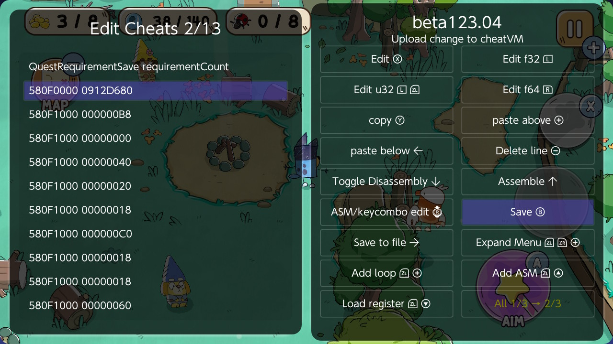

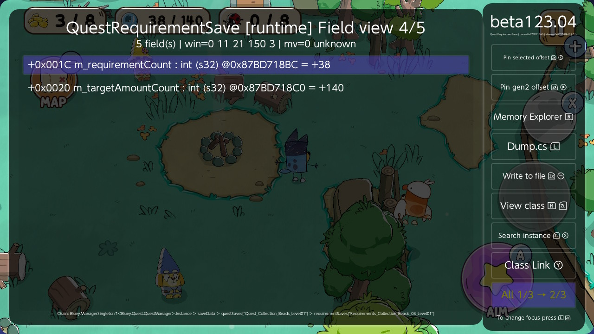

## 6. Speed and moon jump

- **Speed x2**: hold **ZL** to run at double speed. The cheat hooks the game's movement code (`PlayerMove::UpdateVelocity`), so it is only active while ZL is held.
- **Moon jump**: hold **ZL+B** to float up. It sets the vertical speed of Bluey's physics body while the keys are held, so let go to come down.

## Key summary

| Screen | Key | Action |
|---|---|---|
| Cheat list | **L** | Edit Cheat |
| Edit Cheats | **ZL+Right** | Jump to target (cursor on the first line of a pointer cheat) |
| Memory Explorer | **Y+ZL+ZR** | Class field: open the object at the cursor |
| Field / dictionary view | **R+ZL** | View class: open the object a row points to |
| Field / dictionary view | **ZL+Minus** | Extract: go into a row, or pick a number to show |
| Field / dictionary view | **X** | Edit value |
| Any | **B** | Back |
| Any | **L+ZR** | Focus menu: Switch view shows all buttons |
