# Fountains -- making cheats with Breeze

This guide shows how the Fountains cheats were made with Breeze, and how to make them yourself. You find a value with Search Manager, read the player's stats around it in Memory Explorer, let **Find chain** find a route to it that works in every room, and make the cheat from that route. Fountains is made with the **Godot** engine. The same approach works for other Godot games, which keep a script's variables the same way.

| | |
|---|---|
| Game | Fountains 2.1.1 |
| Title ID | `010063302712A000` |
| Build ID | `CCE53AD937702726` |
| Engine | Godot 4.5 (GDScript) |
| Ready-made cheats | [`CCE53AD937702726.txt`](CCE53AD937702726.txt) |
| Breeze | **beta123.08** or later; **Find chain** for Godot (step 3) needs the release after beta123.08 |

If you only want the cheats, copy [`CCE53AD937702726.txt`](CCE53AD937702726.txt) to `sdmc:/switch/breeze/cheats/010063302712A000/` and press **Load Cheats from file** (Y) in Breeze's cheat menu.

| Cheat | What it does |
|---|---|
| Infinite Water | keeps the flask full (copies max water into water) |
| Infinite Health | keeps the red bar full (copies max HP into HP) |
| Infinite Stamina | keeps the green bar full (copies max stamina into stamina) |
| Coins 999,999 | sets your coins to 999999 |
| Attack 100 (5x) | 100 damage per hit instead of 20 |
| Attack 9999 (one hit) | every hit kills |
| Move Speed 1.5x / 2x | movement speed 139.5 or 186 instead of 93 |

The three "Infinite" cheats copy your current maximum, so they keep working when an upgrade raises it. Attack and speed write a fixed number, which replaces any upgrade to those stats while the cheat is on.

## How the game keeps its stats

The player is a Godot node named `Player`, and its script keeps all its variables in one list. Each entry is 24 bytes (0x18): a **type** number, 8 bytes later the **value**, then 8 bytes of padding. The types that matter here are `2` (a whole number) and `3` (a decimal number, stored as an 8-byte double, Breeze's **f64** / **dbl**). The player's list has 152 entries, and these are the ones the cheats use:

| Entry | Offset of the value | Type | What it is | Normal value |
|---|---|---|---|---|
| 3 | `+0x50` | f64 | movement speed | 93 |
| 4 | `+0x68` | f64 | max HP | 80 |
| 6 | `+0x98` | f64 | HP | |
| 79 | `+0x770` | f64 | damage per hit | 20 |
| 82 | `+0x7B8` | f64 | max water | 4 |
| 83 | `+0x7D0` | f64 | max stamina | 45 |
| 98 | `+0x938` | f64 | stamina | |
| 99 | `+0x950` | f64 | water | |
| 100 | `+0x968` | int | coins | |

The stat screen in the game's inventory shows the same numbers: water 4.0, green 45 (stamina), red 80 (HP) and the sword's 20.

---

## 1. Find your coins with Search Manager

Coins are a whole number that you can read off the screen, so they are the easiest thing to search for. On the main screen choose **SearchManager** (L), then **Search Setup** (Y). Press **A=** (X), type your coin count, and choose the `u32` type and the `==*A` condition. Here the count was 125038:

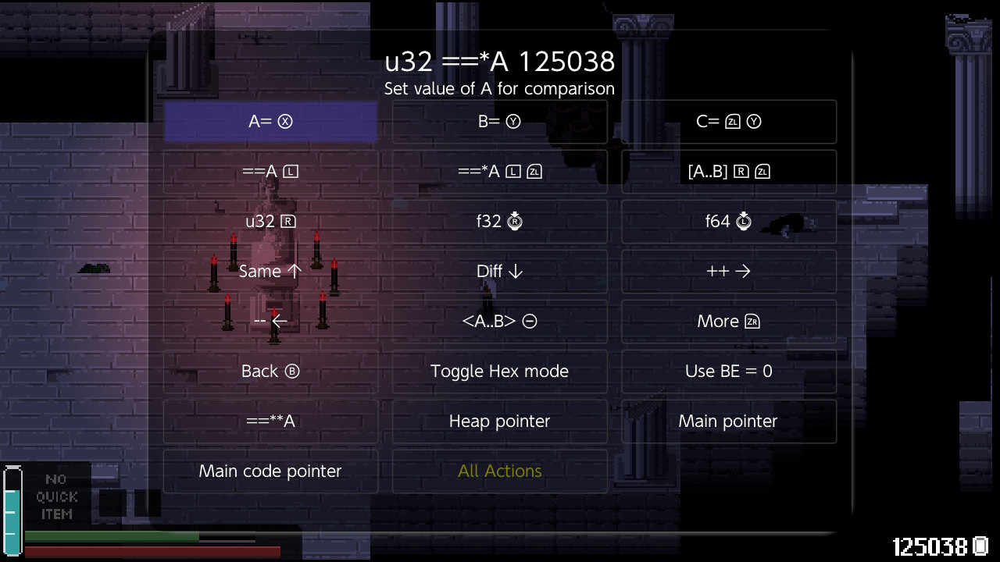

Press **B** to go back and **Start Search** (X). Breeze searches all 3 GB of the game's memory in about 8 seconds and finds 2 candidates:

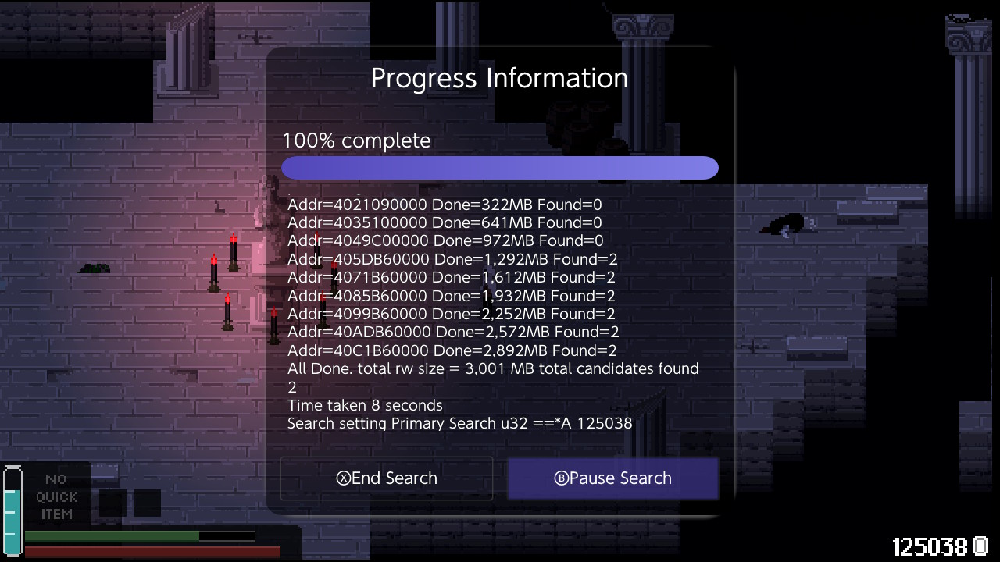

Press **End Search**, then **Show Candidates** (L):

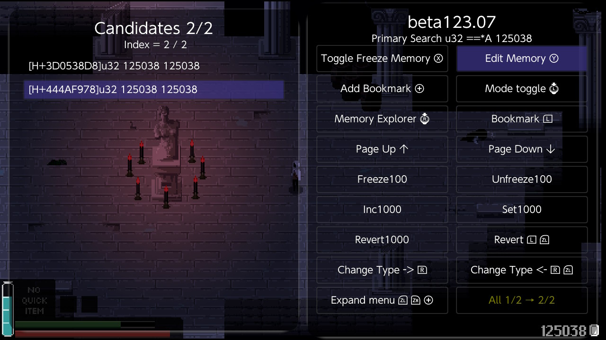

One of the two is the number the coin counter at the bottom right draws. The other is the player's own coins, the one the game spends. Look at both in the next step to tell them apart.

## 2. Look at the value in Memory Explorer

Put the cursor on a candidate and press **Memory Explorer** (RS). With **Change Type** (R+ZL) set to `u64`, the player's coins look like this:

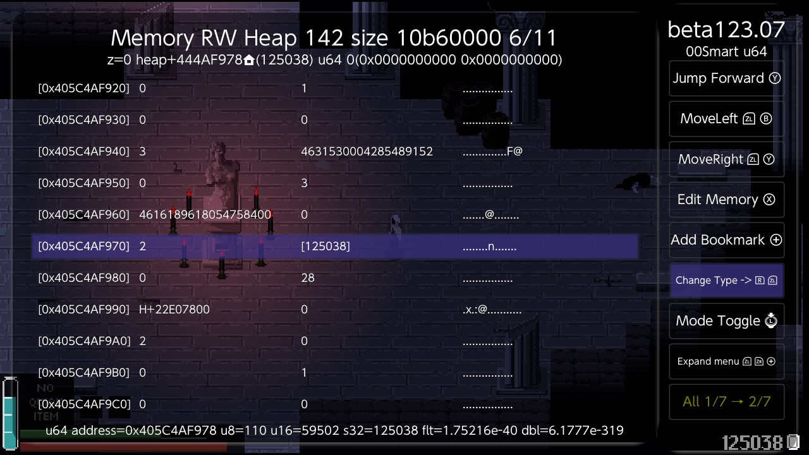

The highlighted row is the coins entry: the type `2` (a whole number), and next to it the value, `[125038]`. The entries above it show type `3` with a large number next to it: these are decimals that the u64 view cannot show. Press **Change Type** (R+ZL) until the header says `dbl`:

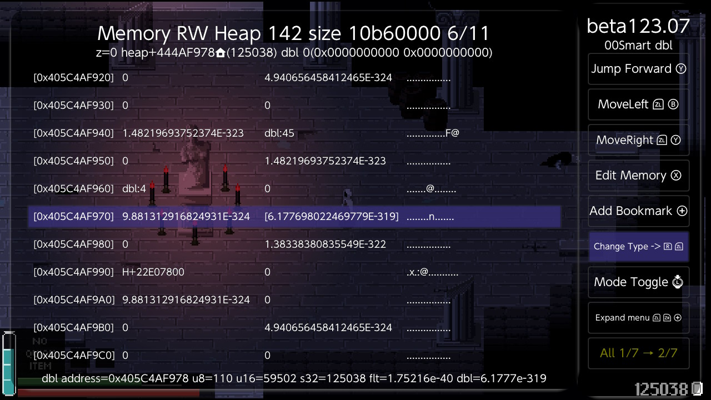

Now `dbl:4` is the water just before the coins (entry 99), and `dbl:45` is the stamina before that (entry 98). A type number followed by a value every 24 bytes is how to recognise a Godot script variable. In the other candidate the coins are not surrounded by entries like these.

You could freeze this address now, but it would not last. The player is rebuilt every time you change rooms or die, and the list moves to a new address. The cheats have to find the player afresh every time they run.

## 3. Find chain: let Breeze find the way to the player

The address from step 1 is only good until you leave the room. A cheat needs a route from something that never moves to the player's list -- a pointer chain. In a Godot game, **Find chain** finds it.

Go back to the candidates (B), put the cursor on the player's coins and press **Find chain** (Y+ZR). Breeze walks the game's own objects from the root of the scene tree -- the nodes, and the variables their scripts hold -- and lists every route it finds to the coins, cheapest first:

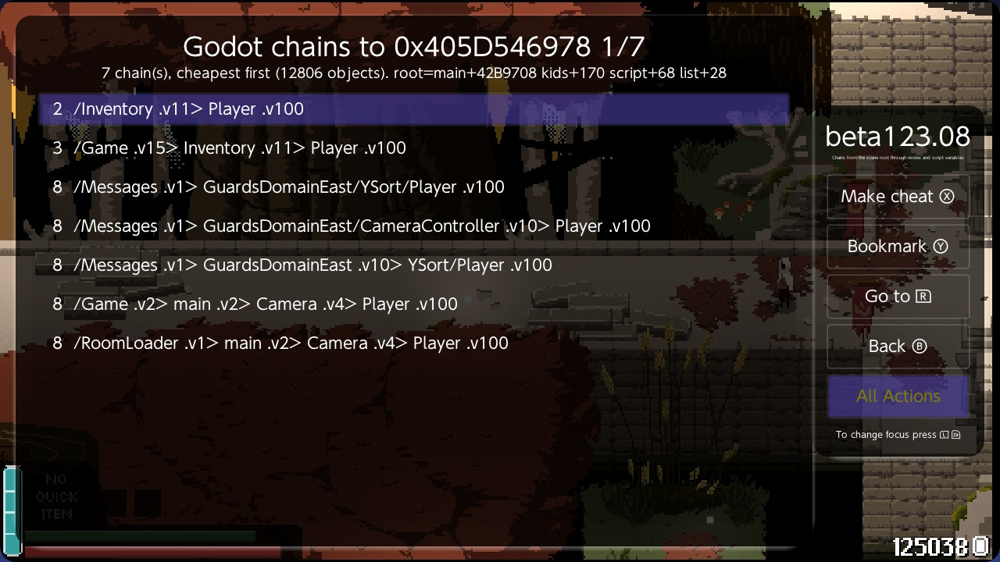

How to read a row:

| Part | Meaning |
|---|---|
| `/Inventory` | a node directly under the scene root, here the `Inventory` autoload |
| `.v11>` | variable 11 of that node's script, which holds the next object |
| `Player .v100` | variable 100 of the Player's script: the coins |
| the number on the left | the cost of the route |

Routes through **autoloads** -- nodes the game loads once and keeps for the whole session -- cost least, because they are the same in every room. Routes through the current room (here `GuardsDomainEast`) cost 8: the room is rebuilt when you leave it, and so is everything that route passes through.

Take the top row and press **Make cheat** (X). Breeze asks for a name, then adds a cheat that writes the value the coins have now, switched off in the cheat list. **Bookmark** (Y) saves the route instead, and **Go to** (R) opens it in Memory Explorer.

On Fountains Find chain took 3 seconds and looked at about 13,000 objects. The cheat it made kept the coins after a room change, when the player had been rebuilt at a new address.

**Why not a pointer search?** It was tried. Two pointer searches on Fountains, one for the player's list and one for the player itself, both ran out of memory before reaching the `Inventory` route. All 419 chains they did find went through the current room, and none still worked after a room change. **Perform Clean up** removed all but 4 of them, and those 4 pointed at other objects. In a Godot game, use Find chain.

**Other stats** are in the same list (the table above), so their cheats use the same route with a different last offset: entry number x `0x18` + 8. Or search for the value and run Find chain on it.

## 4. How the cheats find the player

Godot keeps a few always-loaded nodes called **autoloads** under the root of the scene tree. They load in a fixed order, so they are always at the same place. One of them, `Inventory`, keeps a reference to the player in its entry 11 -- the route Find chain lists first. So every cheat in the file starts with the same eight lines: from a fixed address in the game's code to the root, to `Inventory`, to the player, to the player's list.

In the cheat menu, put the cursor on a cheat and press **Edit Cheat** (L):

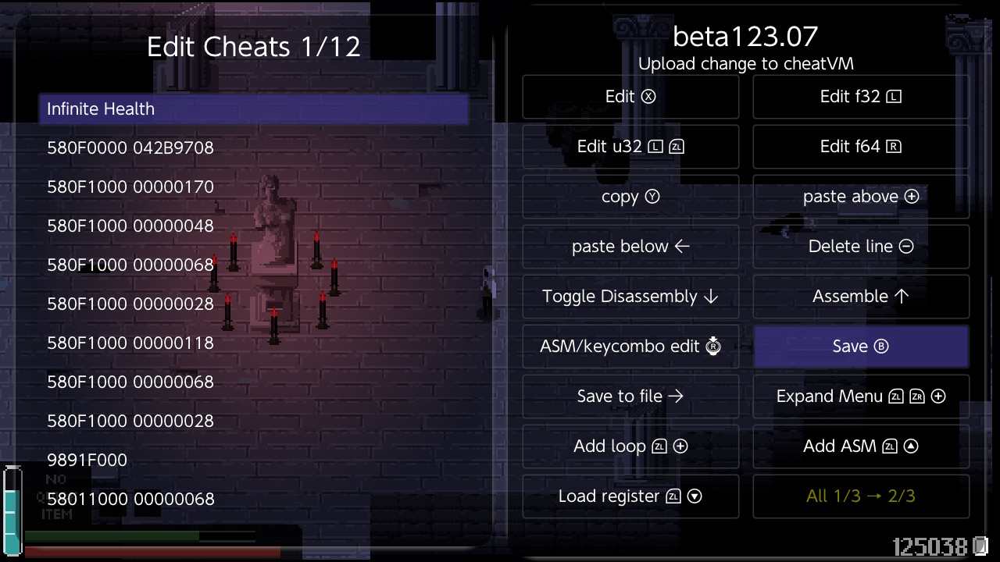

**Toggle Disassembly** (Down) shows what each line does:

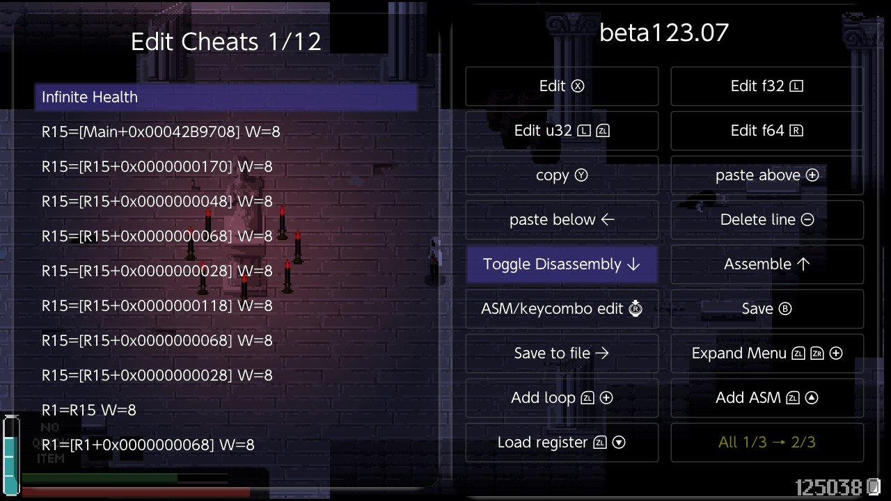

```
580F0000 042B9708     R15 = the root of the scene tree, from a fixed address in the game's code
580F1000 00000170     > the root's list of children
580F1000 00000048     > child 9, the Inventory autoload
580F1000 00000068     > its script
580F1000 00000028     > its list of variables
580F1000 00000118     > entry 11, the player
580F1000 00000068     > the player's script
580F1000 00000028     > the player's list of variables
9891F000              R1 = R15
58011000 00000068     R1 = max HP (entry 4)
A81F0200 00000098     write it into HP (entry 6)
```

The coins cheat ends with a plain write instead:

```
780F0000 00000968                 entry 100, coins
680F0000 00000000 000F423F        = 999999
```

and the attack and speed cheats write a double:

```
780F0000 00000770                 entry 79, damage per hit
680F0000 40590000 00000000        = 100.0
780F0000 00000050                 entry 3, movement speed
680F0000 40674000 00000000        = 186.0
```

## 5. Jump to target and Trace cheat: see what a cheat does

Breeze can run a cheat without switching it on and show you where it goes. In Edit Cheats, put the cursor on the first line and press **Jump to target** (ZL+Right). Breeze runs the cheat as a dry run -- it reads the game's memory but writes nothing -- and opens Memory Explorer at the address the cheat writes, here HP (entry 6), already shown as a double:

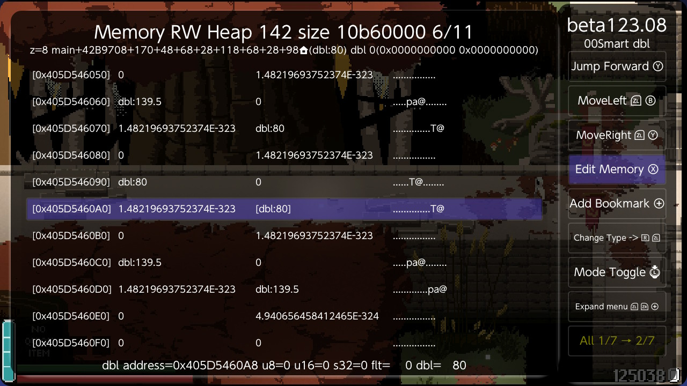

The line under the title is the whole chain, `main+42B9708+170+48+68+28+118+68+28+98`. The rows around it are the player's list: `139.5` (movement speed, with the Move Speed 1.5x cheat on), then `80`, `80`, `80` (max HP, a copy of it, and HP). From here you can scroll to any entry in the table above and use **Edit Memory** (X) to try a value out before you make a cheat for it.

**Trace cheat** (ZR+Right) lists every step instead: each pointer the cheat follows (`hop`), each value it reads (`read`), and what it would write where (`write`). For Infinite Health that is eight hops down to the player's list, a read of max HP, and a write of it into HP. **Go to** (X) on any row opens that address.

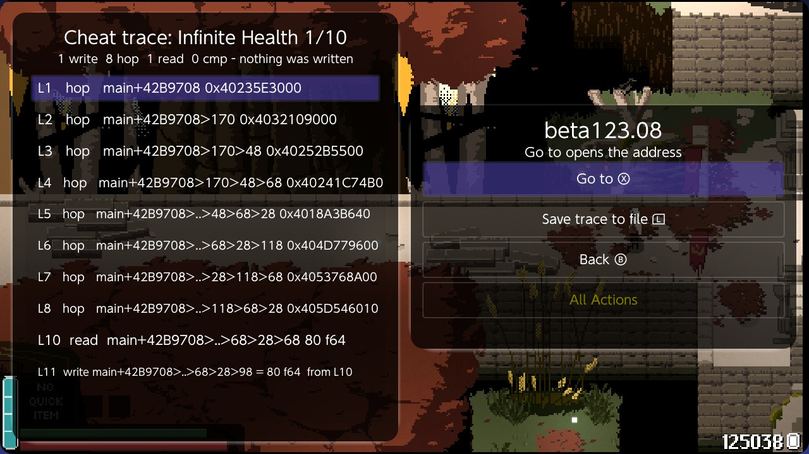

## 6. Turn the cheats on

Open **Cheat Menu** from the main screen. Tick the cheats you want with **Toggle Cheat** (X). A solid square means on:

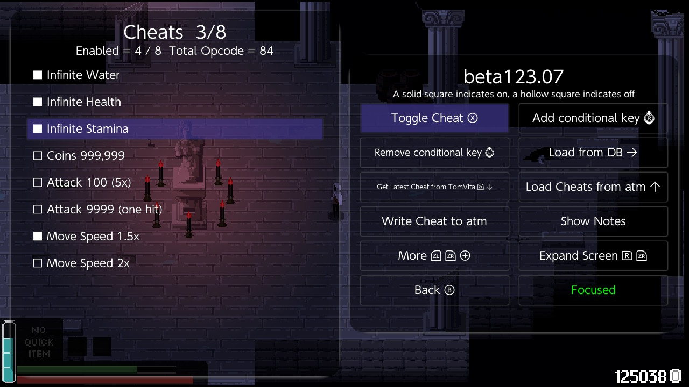

## Notes

- **Turning a cheat off** stops it writing, but the last value stays until the player is rebuilt. Attack and speed go back to normal after a room change or a death.
- **Only entry 3 sets your speed.** Entries 7 and 8 also read 93, but the game copies entry 3 into them, and if you change them it changes them back.
- **Health can still dip.** dmnt runs cheats about 12 times a second, so a hit shows for a moment before the cheat refills it.
- **A cheat with fixed heap addresses** (`08100000 ...` lines) from an older version of this file is wrong in the next session. Use this file.

## Key summary

| Screen | Key | Action |
|---|---|---|
| Main | **L** | SearchManager |
| Main | **R** | Cheat Menu |
| Search Manager | **Y** | Search Setup |
| Search Setup | **X** | A= (the value to search for) |
| Search Manager | **X** | Start Search |
| Search Manager | **L** | Show Candidates |
| Candidates | **RS** | Memory Explorer |
| Candidates | **Y+ZR** | Find chain |
| Godot chains | **X** | Make cheat |
| Godot chains | **Y** | Bookmark |
| Godot chains | **R** | Go to |
| Memory Explorer | **R+ZL** | Change Type |
| Memory Explorer | **X** | Edit Memory |
| Cheat Menu | **X** | Toggle Cheat |
| Cheat Menu | **Y** | Load Cheats from file |
| Cheat Menu | **L** | Edit Cheat |
| Edit Cheats | **Down** | Toggle Disassembly |
| Edit Cheats | **ZL+Right** | Jump to target |
| Edit Cheats | **ZR+Right** | Trace cheat |
| Any | **B** | Back |
