# Minecraft Dungeons II -- making cheats with Breeze

This guide makes cheats for Minecraft Dungeons II from scratch with Breeze's **Attributes (GAS)** screen: infinite health, arrows that never run out, a potion that is always charged, full souls, emeralds, TNT and faster movement. No value searching is needed. The same steps work for other Unreal Engine games that keep their stats in the Gameplay Ability System.

| | |
|---|---|
| Game | Minecraft Dungeons II 1.1.1.0 |
| Title ID | `0100A7C01B792000` |
| Build ID | `9E9D887D59F7F7DB` |
| Engine | Unreal Engine 5 (5.6 or later) |
| Ready-made cheats | [`9E9D887D59F7F7DB.txt`](9E9D887D59F7F7DB.txt) |
| Breeze | **beta123.06** or later |

If you only want the cheats, copy [`9E9D887D59F7F7DB.txt`](9E9D887D59F7F7DB.txt) to `sdmc:/switch/breeze/cheats/0100A7C01B792000/` and press **Load Cheats from file** in Breeze's cheat menu. The file has the same seven cheats this guide makes, plus a backup folder with a second version of each (see step 3).

## How the game keeps its stats

Minecraft Dungeons II uses Unreal's **Gameplay Ability System** (GAS). Every player stat -- health, arrows, potion charges, souls, emeralds, TNT, movement speed, cooldowns, damage multipliers -- is an *attribute* in one of the player's *attribute sets*, and each attribute holds two numbers: a **base** value and a **current** value. Breeze can list all of them and make a cheat from any one, so there is nothing to search for.

---

## 1. Open the attribute list

Start a level so your character is in the world, then open Breeze. On the main screen choose **Unreal**.

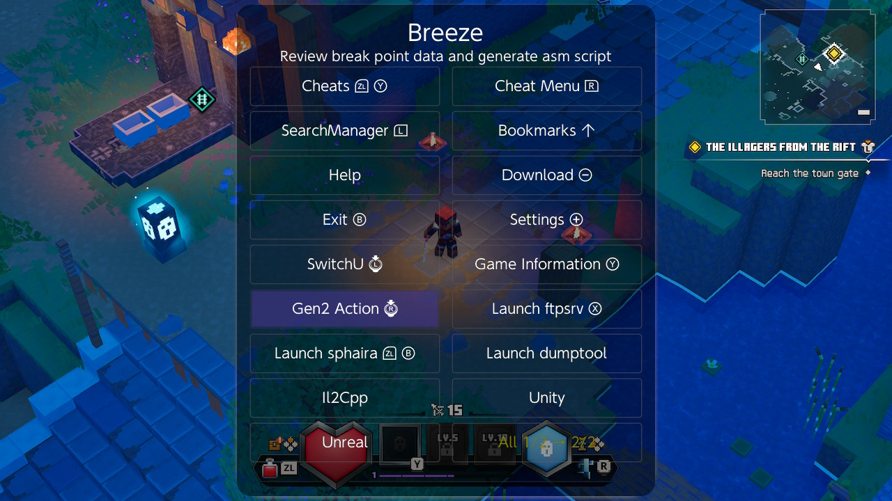

In the Unreal menu choose **Attributes (GAS)** (Y).

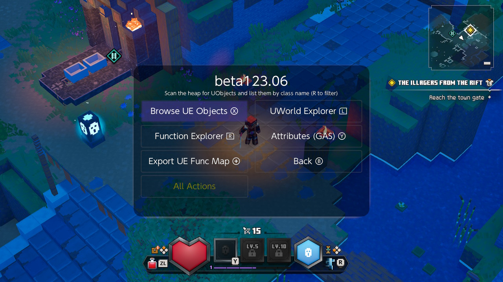

Breeze finds your character's ability system and lists every attribute set (the `== [n] ATR_...` lines) with each attribute and its current value. In this game there are 23 sets and 206 attributes.

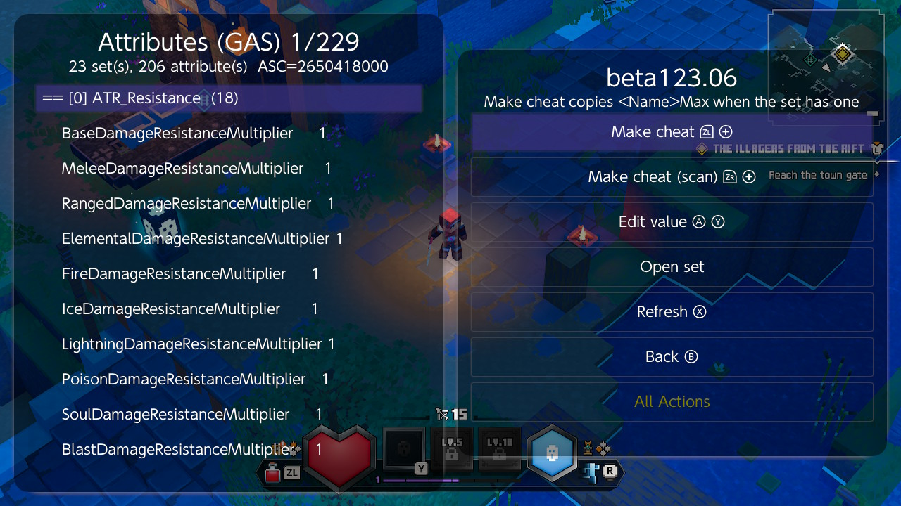

The number in brackets is the set's position in the list; it is used by **Make cheat** in the next step. "shared vtable" after a set's name matters only for **Make cheat (scan)** in step 3.

Some sets worth knowing in this game:

| Set | Attributes |
|---|---|
| `ATR_Health` | `Health`, `HealthMax`, `HealthPotionCharges`, `HealthPotionChargesMax`, `HealthPotionBaseCooldown` |
| `ATR_RangedAttack` | `RangedAttackAmmoCount` (arrows), `RangedAttackAmmoCountMax`, `RangedAttackRechargeTime` |
| `ATR_Soul` | `Souls`, `SoulsMax` |
| `ATR_Currency` | `Emeralds`, `EmeraldsMax` |
| `ATR_Throwable` | `ThrowableHeldCount` (TNT), `ThrowableHeldCountMax` |
| `ATR_Movement` | `MovementSpeed`, `MovementSpeedMultiplier`, `RollCooldown`, `RollCharges` |
| `ATR_XP` | `XP`, `Level`, `EnchantmentPoints` |
| `ATR_Damage` | `BaseDamageMultiplier`, `CriticalHitChance`, ... |

## 2. Make cheat: infinite health

Scroll to `Health` under `ATR_Health` and put the cursor on it.

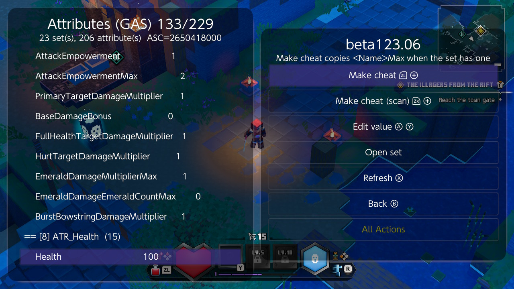

Press **Make cheat** (**ZL+Plus**). Breeze adds the cheat to your cheat list and tells you what it made:

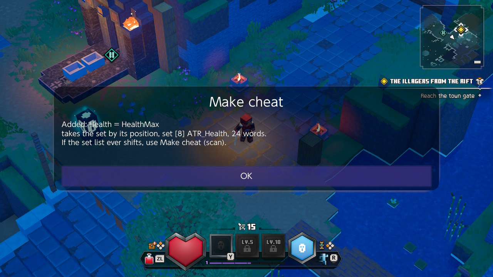

The cheat is called **Health = HealthMax**. Because the set also has a `HealthMax`, Breeze makes the cheat copy the maximum into `Health` instead of freezing the number you see now -- so when your maximum health grows with level or gear, the cheat keeps you at the new maximum. It writes both the base and the current value.

The same happens for every attribute that has a matching `...Max` in its set. Making cheats this way on `HealthPotionCharges`, `Souls`, `Emeralds` and `ThrowableHeldCount` gives:

- **HealthPotionCharges = HealthPotionChargesMax** -- the potion is always charged
- **Souls = SoulsMax** -- the soul gauge is always full
- **Emeralds = EmeraldsMax** -- 9999 emeralds
- **ThrowableHeldCount = ThrowableHeldCountMax** -- always 3 TNT

## 3. Make cheat (scan): infinite arrows

**Make cheat** finds the attribute set by its position in the list (`[3]` for `ATR_RangedAttack`). That position stayed the same across restarts of this game. If a game update ever changes the order, a cheat made this way would write into the wrong set.

**Make cheat (scan)** (**ZR+Plus**) makes a longer cheat that searches the list for the set every time it runs, so the order does not matter. Put the cursor on `RangedAttackAmmoCount` under `ATR_RangedAttack`:

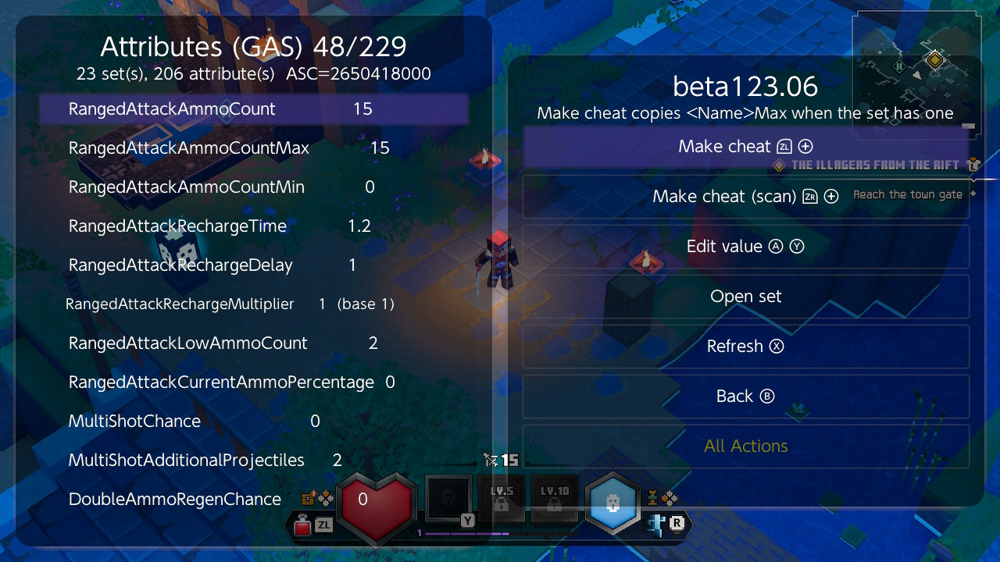

and press **ZR+Plus**:

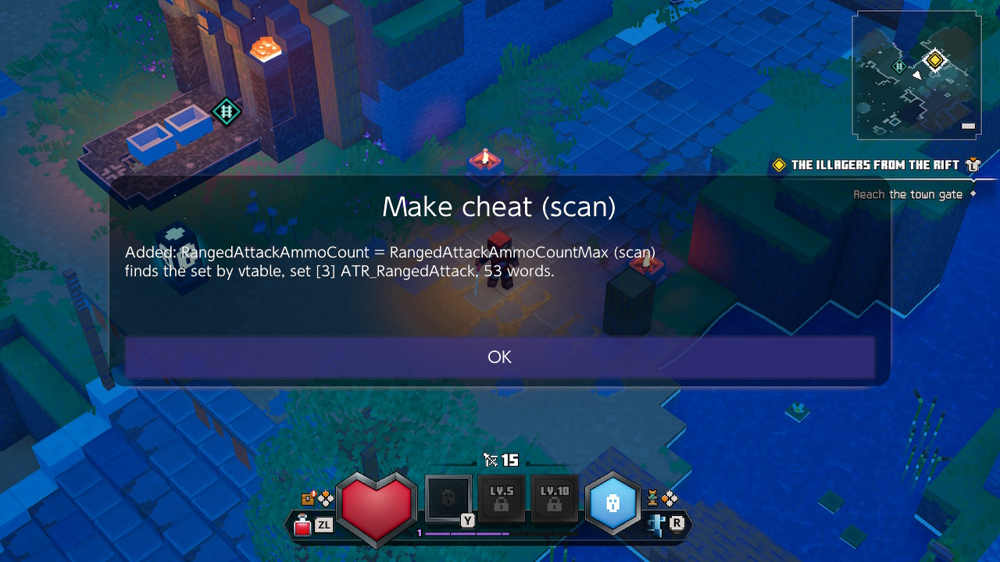

The scan recognises the set by its C++ class, which it can only do when no other set shares that class -- sets marked "shared vtable" cannot be scanned for, and Breeze says so. The scan version is 53 opcode words against 24 for the plain one; dmnt allows 1024 words for all enabled cheats together, so a handful of scan cheats is no problem.

## 4. A value of your own: faster movement

When there is no `...Max` to copy, **Make cheat** freezes the value as it is now. So set the value first with **Edit value** (**ZR+Y**). Put the cursor on `MovementSpeedMultiplier` under `ATR_Movement` and press **ZR+Y**:

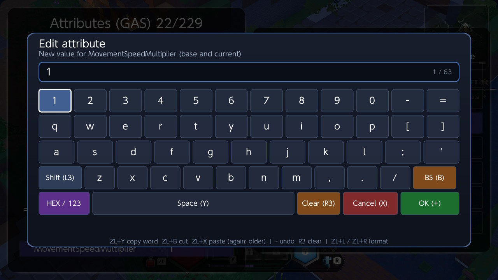

Type `1.5` and confirm. Edit value writes both the base and the current value, and the list shows the new number:

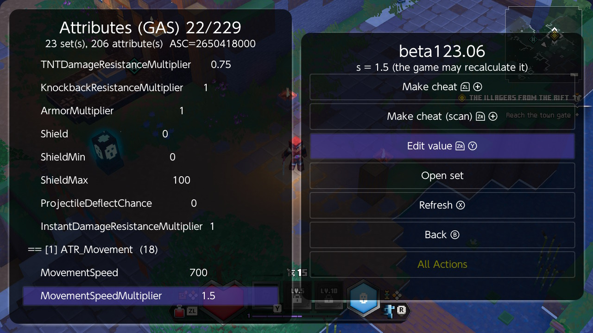

Now **Make cheat** (**ZL+Plus**) makes **MovementSpeedMultiplier 1.5**:

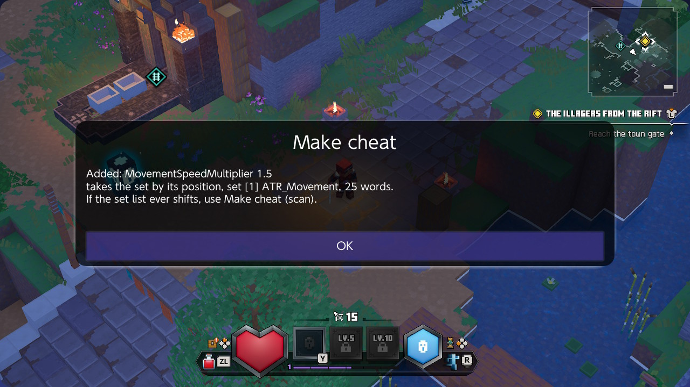

An edited value on its own does not last: the game recalculates many attributes when an effect starts or ends. The cheat writes it again many times a second.

## 5. Turn the cheats on

Back in the main screen, open **Cheat Menu**. The new cheats are there, switched off. Tick the ones you want with **Toggle Cheat** (X).

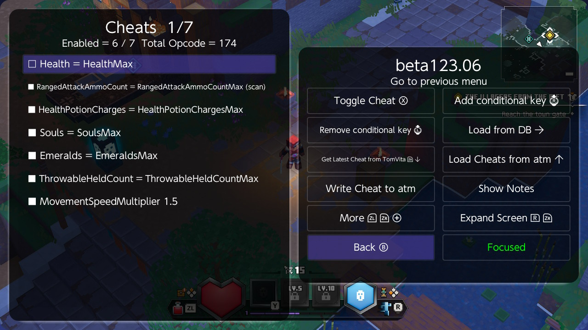

To see what Breeze wrote, put the cursor on a cheat and press **L** (Edit Cheat):

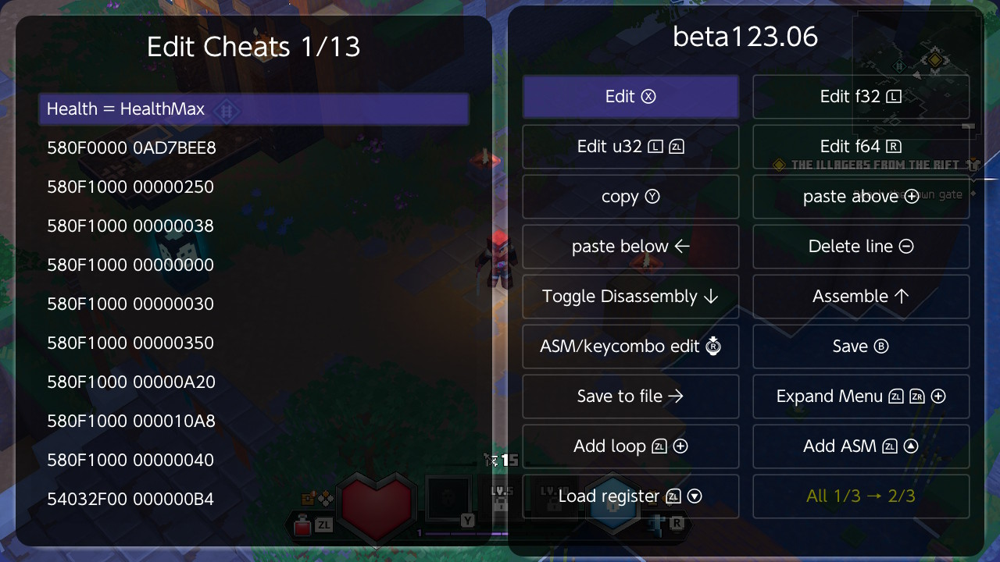

```
580F0000 0AD7BEE8     the game world, from a fixed address in the game's code
580F1000 00000250     > game instance
580F1000 00000038     > local players
580F1000 00000000     > the first local player
580F1000 00000030     > player controller
580F1000 00000350     > your character
580F1000 00000A20     > its ability system
580F1000 000010A8     > the list of attribute sets
580F1000 00000040     > set [8], ATR_Health
54032F00 000000B4     read HealthMax (current value)
A43F0200 00000090     write it to Health's base value
A43F0200 00000094     write it to Health's current value
```

With all seven on, the soul gauge is full, arrows stay at 15 and health stays at the maximum:

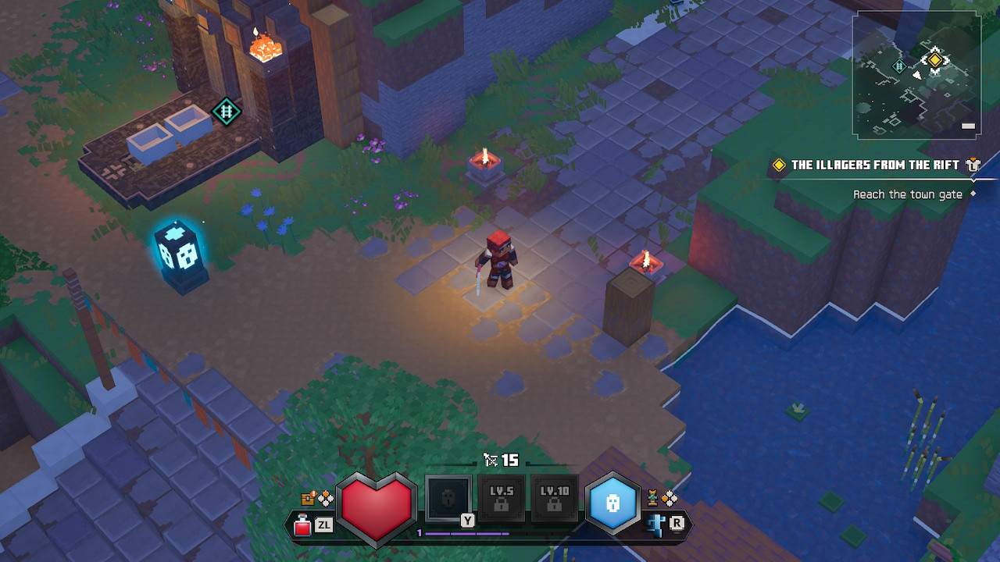

## 6. Beyond attributes

Not everything is an attribute. Three other tools in the Unreal menu help to find the rest:

- **UWorld Explorer** shows the chain from the world to your character: game instance, local player, player controller, your character (`BP_AlexCharacter_C`) and its movement component.
- **Browse UE Objects** lists every object in the game (over 100,000 here), with **Filter by class** (R): for example `Character`, `Inventory` or `AbilitySystem`. **Open UClass view** shows the object you pick.
- In a field view (Memory Explorer > **Class field**), **Open** on a row that points to another object -- such as your character's `AbilitySystemComponent` or `InventoryManagerComponent` -- opens that object. **Make cheat** there is **ZL+Plus**.

## Notes

- **Open set** in the attribute screen opens the set in the field view. Press its button: pressing **A** always activates the highlighted button.
- If health still drops briefly before refilling, that is the cheat catching up: dmnt runs cheats about 12 times a second.
- The potion may also have a cooldown separate from its charges (`HealthPotionBaseCooldown` is 20 seconds). If it is not ready straight after drinking, set that attribute to a small value with Edit value and freeze it with Make cheat.

## Key summary

| Screen | Key | Action |
|---|---|---|
| Main | -- | **Unreal** |
| Unreal | **Y** | Attributes (GAS) |
| Attributes (GAS) | **ZL+Plus** | Make cheat (copies `...Max` when there is one) |
| Attributes (GAS) | **ZR+Plus** | Make cheat (scan) |
| Attributes (GAS) | **ZR+Y** | Edit value |
| Attributes (GAS) | **X** | Refresh |
| Cheat Menu | **X** | Toggle Cheat |
| Cheat Menu | **L** | Edit Cheat |
| Any | **B** | Back |
